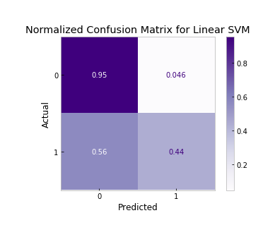
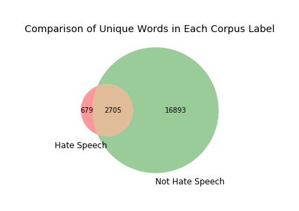

# Twitter Hate Speech Detection
## *Can content moderation be automated?*

**Please note:** Because of the subject matter of this project, all notebooks contain offensive language from the dataset.

## Overview

This project aims to **automate content moderation** to identify hate speech using **machine learning binary classification algorithms.** Baseline models included Random Forest, Naive Bayes, Logistic Regression and SVM models. The final model was a Linear SVM model with an F1 of 0.3955 and Recall (TPR) of 0.4373. This poor performance can be attributed to the massive class imbalance and the model's ability to "understand" the nuances of English slang and slurs. Ultimately, automating hate speech detection is an extremely difficult task. And although this project was able to get that process started, there is much more work to be done in order to keep this content off of public-facing forums such as Twitter.

## Business Problem
Human content moderation exploits people by consistently traumatizing and underpaying them. In 2019, an [article](https://www.theverge.com/2019/6/19/18681845/facebook-moderator-interviews-video-trauma-ptsd-cognizant-tampa) on The Verge exposed the extensive list of horrific working conditions that employees faced at Cognizant, which was Facebook’s primary moderation contractor. Unfortunately, every major tech company, including Twitter, uses human moderators to some extent, both domestically and overseas.

Hate speech is defined as **abusive or threatening speech that expresses prejudice against a particular group, especially on the basis of race, religion or sexual orientation.** Usually, the difference between hate speech and offensive language comes down to subtle context or diction. 

## Data & Methods
The dataset for this capstone project was sourced from a study called Automated Hate Speech Detection and the Problem of Offensive Language  conducted by Thomas Davidson and a team at Cornell University in 2017. The GitHub repository can be found [here](https://github.com/t-davidson/hate-speech-and-offensive-language). 

- The dataset is provided as a `.csv` file with 24,802 text posts from Twitter where 6% of the tweets were labeled as hate speech
- The labels on this dataset were voted on by crowdsource and determined by majority-rules
- To prepare the data for binary classification, labels were manually replaced by changing existing 1 and 2 values to 0, and replacing 0 to 1 to indicate hate speech

### Cleaned Dataset Columns

| Column Name | Description |
|-|-|
| total_votes | number of CrowdFlower users who coded each tweet (minimum is 3, sometimes more users coded a tweet when judgments were determined to be unreliable by CF). |
| hate_speech_votes | number of CF users who judged the tweet to be hate speech. |
| other_votes | number of CF users who judged the tweet to be offensive language or neither. |
| label | class label for majority of CF user votes. 1 - hate speech 0 - not hate speech |
| tweet | raw tweets |
| clean_tweet | tweets filtered through NLP data cleaning process |

## Data Understanding

### 1. What are the linguistic differences between hate speech and offensive language?


Linguistically, it's important to note that the difference between hate speech and offensive language often comes down to how it targets marginalized communities, often in threatening ways.

- Although these graphs have very similar frequently occurring words, there are a few that stand out
- For instance, Hate Speech typically contains the N-word with the hard 'R'. 
- **The use of this slur could indicate malicious intent, which goes beyond possibly using the word as slang.**

Examples like that one demonstrate the nuances of English slang and the fine line between Hate Speech and offensive language. **Because of the similarities of each label’s vocabulary, it could be difficult for machine learning algorithms to differentiate between them and determine what counts as hate speech.**

### 2. What are the most popular hashtags of each tweet type?


We can see some more parallels and differences between what is classified as hate speech or not. 

- #tcot stands for "Top Conservatives On Twitter” and it appears in both groups
- #teabagger, which refers to those who identify with the Tea Party, that is primarily (but not exclusively) associated with the Republican Party, appears in only the “Not Hate Speech” cloud
- Both hashtags are used among Alt-Right communities

Additionally, the #r**skins hashtag appears in only the Not Hate Speech cloud. This was the former name of the Washington NFL team. Knowing the context, we know that hashtag could certainly include text that constitutes as hate speech. With this, and other hashtags that appear in the “Not Hate Speech” cloud, we can clearly see the very slight differences between the two labels.

From this, we can recommend that **Twitter should closely monitor those top hashtags for potential posts containing hate speech** or even regular offensive language.


### 3. What is the overall polarity of the tweets?


The compound polarity score is a metric that calculates the sum of all the [lexicon ratings](https://github.com/cjhutto/vaderSentiment/blob/master/vaderSentiment/vader_lexicon.txt) which have been normalized between -1 and +1. With -1 being extreme negative and +1 being extreme positive. **This score encompasses the overall sentiment of this corpus.**

- Hate Speech tweets on average have a compound score of -0.363
- Non Hate Speech tweets on average have a compound score of -0.263

According to this metric, both classes of tweets have pretty negative sentiments because their normalized compound scores are less than -0.05. 

Additionally from this graph, we can see that tweets classified as Hate Speech are especially negative. This further emphasizes how slim the difference between the two labels are.

## Final Model Performance

F1 score was used as the main metric for this project, while also looking at Precision and Recall. 

- The F1 score finds the harmonic mean between Precision and Recall, and it's useful for data with high class imbalance
- Weighted F1 score can account for the class imbalance in labels by calculating metrics for each label. This results in an F1 score that is not between precision and recall

Overall, we want as much hate speech to flagged as possible and so that it can be efficiently removed.



As expected, the final model has a True Negative Rate of 95% and a True Positive Rate of only 44%.

- This is consistent with the final model's evaluation metrics, where it got a Recall of .437, aka TPR
- In this business context, we would ideally want as many True Negatives as possible, because that would be identifying Hate Speech correctly
- Therefore, this is where the final model fails

Also, we can see that only 4.6% of predictions are False Positives. Which mean that they were classified as "Hate Speech" when it's not. It's great that this amount is low, because site users tend to launch complaint reports when their content is over-flagged as hate speech content when it's not.

**Overall, the Recall of this model needs to be greatly improved, in addition to the F1 of .0.3955.**

## Conclusion

**The final mode's performance is indicative of the two major roadblocks of the project:**
1. The massive class imbalance of the dataset 
2. The model's ability to identify what constitutes as hate speech

The issue of class imbalance is manageable with preprocessing techniques and oversampling/undersampling techniques. However, identifying hate speech is an overall problem that many major tech companies like Twitter, Facebook and Instagram are still struggling with.

This is because the line between Hate Speech and regular offensive language is so fine. 
- Hate speech is defined as abusive or threatening speech that expresses prejudice against a particular group, especially on the basis of race, religion or sexual orientation. 
- Usually, the difference between hate speech and offensive language comes down to subtle context or diction.



Here, we can see that there are 679 words unique to the "Hate Speech" label. Some of these words are nonsensical or meaningless, but some are especially hateful terms. 
- For example, this label contains phrases such as "sp-cs", "mo-kies", "ov-nj-w", "fa--ot" and much more. These are all ethnic or homophobic slurs. 
- Most notably, we saw in earlier EDA that this label disproportionately contains the N-word with the hard "R". 
Language like this directly demonstrates hate speech by targeting marginalized groups.

However, it's hard for a machine learning model to understand the nuances with this hateful slang. Although these words are unique to the "Hate Speech" label corpus, **there's simply not enough data for that label.** 

- Therefore, an important next step would be to collect more data that has been identified as hate speech by CrowFlow voters.
- Additionally, we can recommend for now that Twitter manually moderate these words, just like it could with the top hashtags that were identified for each label in earlier EDA.

Ultimately, automating hate speech detection is an extremely difficult task because of the nuances in English slang and slurs. This project was able to get that process started, but there is much more work to be done to keep this content off of public-facing forums such as Twitter.

## Next Steps

To further develop this project, here are some immediate next steps that anyone could execute.

- Collect more potential "Hate Speech" data to be labeled by CrowdFlow voting system
- Improve final model with different preprocessing techniques, such as removing offensive language as stop words
- Evaluate model with new tweets or other online forum data to see if it can generalize well
- LDA Topic Modeling with Gensim
- Deploy MVP on Webapp via StreamLit

## Repository Contents
```bash
.
├── models                             # contains model iterations
├── pickle                             # contains cleaned data
├── preprocessing                      # contains all data preperation iterations and EDA notebooks
│   ├── data_cleaning.ipynb            # raw data cleaning notebook
│   ├── eda_notebook.ipynb             # exploratory data analysis notebook
│   └── nlp_preprocessing.ipynb        # feature engineering notebook
├── src                                # source folder
│   └── twitter_data.csv               # raw dataset
├── visualizations                     # contains visualizations and local images
├── presentation.pdf                   # slide deck
├── README.md                          # public-facing preview
└── final_notebook.ipynb               # final version of EDA, feature engineering and modeing process
```

## For More Information

- See the [full project overview](https://github.com/sidneykung/twitter_hate_speech_detection/blob/master/final_notebook.ipynb) in the `final_notebook.ipynb` Jupyter Notebook.

- For additional information or suggestions, contact Sidney Kung at [sidneyjkung@gmail.com](mailto:sidneyjkung@gmail.com)

**Let's connect!**

- [LinkedIn](https://www.linkedin.com/in/sidneykung/)

- [Twitter](https://twitter.com/sidney_k98)

## References

Davidson, T., Warmsley, D., Macy, M. and Weber, I., 2017. Automated Hate Speech Detection and the Problem of Offensive Language. ArXiv,.
