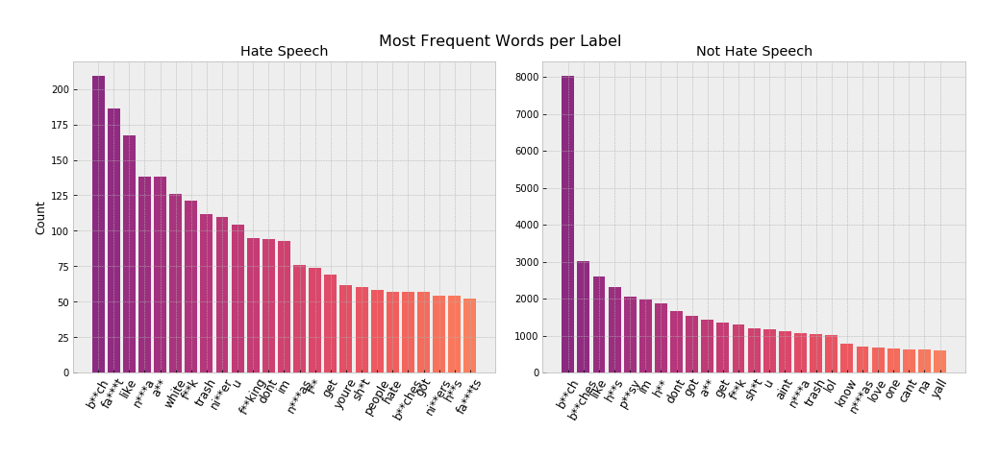
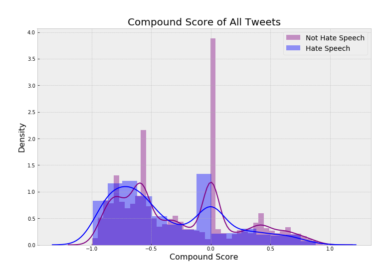
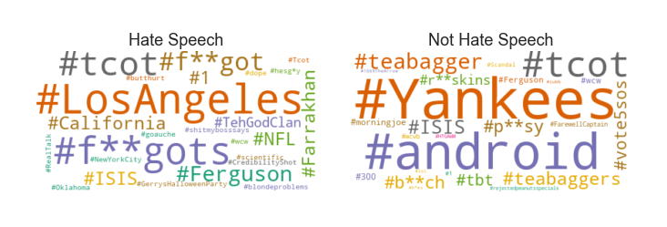

# Twitter Hate Speech Detection
## *Can content moderation be automated?*

#### Project ongoing until January 6

**Please note:** Because of the subject matter of this project, all notebooks contain offensive language from the dataset.

## Overview


## Business Problem
Human content moderation exploits people by consistently traumatizing and underpaying them. In 2019, an [article](https://www.theverge.com/2019/6/19/18681845/facebook-moderator-interviews-video-trauma-ptsd-cognizant-tampa) on The Verge exposed the extensive list of horrific working conditions that employees faced at Cognizant, which was Facebook’s primary moderation contractor. Unfortunately, every major tech company, including Twitter, uses human moderators to some extent, both domestically and overseas.

Hate speech is defined as abusive or threatening speech that expresses prejudice against a particular group, especially on the basis of race, religion or sexual orientation. Usually, the difference between hate speech and offensive language comes down to subtle context or diction. 

Any company with an online forum where users post content could benefit from automating as much as the moderation process as possible. Ultimately, human content moderation is not only detrimental to workers, but also presents a liability to companies that use them.

## Data & Methods
The dataset for this capstone project was sourced from a study called Automated Hate Speech Detection and the Problem of Offensive Language  conducted by Thomas Davidson and a team at Cornell University in 2017. The GitHub repository can be found [here](https://github.com/t-davidson/hate-speech-and-offensive-language). The dataset is provided as a `.csv` file with 24,802 text posts from Twitter where 6% of the tweets were labeled as hate speech. 

Since content moderation is so subjective, the labels on this dataset were crowdsourced and determined by majority-rules. The “class” column labels each tweet as 0 for hate speech, 1 for offensive language or 2 for neither. In order to create a different project and adapt the data to my specific business context, I will be treating the data as a binary classification problem. 

Therefore, the final model will be **predicting whether a tweet is hate speech or not.** To prepare the data for this, I will be manually replacing existing 1 and 2 values as 0, and replacing 0 as 1 to indicate hate speech.

### Cleaned Dataset Columns

| Column Name | Description |
|-|-|
| total_votes | number of CrowdFlower users who coded each tweet (minimum is 3, sometimes more users coded a tweet when judgments were determined to be unreliable by CF). |
| hate_speech_votes | number of CF users who judged the tweet to be hate speech. |
| other_votes | number of CF users who judged the tweet to be offensive language or neither. |
| label | class label for majority of CF user votes. 1 - hate speech 0 - not hate speech |
| tweet | raw tweets |
| clean_tweet | tweets filtered through NLP data cleaning process |

## Data Analysis Questions

1. What are the linguistic differences between hate speech and offensive language?
2. What is the overall polarity of the tweets?
3. What are the most popular hashtags of each tweet type?

## Results



Linguistically, it's important to note that the difference between hate speech and offensive language often comes down to how it **targets marginalized communities, often in threatening ways.**
 
For instance, we can notice from this figure that Hate Speech typically contains the N-word with the hard 'R'. The use of this slur indicates far more malicious intent, which goes beyond possibly using the word as slang.
 
Examples like that demonstrate the nuances of English slang and the fine line between Hate Speech and offensive language.




The Compound score is a metric that calculates the sum of all the [lexicon ratings](https://github.com/cjhutto/vaderSentiment/blob/master/vaderSentiment/vader_lexicon.txt) which have been normalized between -1 and +1. With -1 being extreme negative and +1 being extreme positive. **This score encompasses the overall sentiment of this corpus.**

- Hate Speech tweets on average have a compound score of -0.363
- Non Hate Speech tweets on average have a compound score of -0.263

According to this metric, both classes of tweets have negative sentiments because their normalized compound scores are less than -0.05.

From this graph, we can see that tweets classified as Hate Speech are especially negative. Therefore, although both classes contain offensive language, Hate Speech has much more on average.



Only a few of these hashtags provide meaning. For instance, #teabagger and #tcot are hashtags used among Alt-Right communities. #teabagger refers to those who identify with the Tea Party, which is primarily (but not exclusively) associated with the Repubclican Party. And #tcot stands for "Top Conservatives On Twitter."

It could be expected that those hashtags contain hate speech or offensive language. Others are simply pop culture references, such as #Scandal the TV show or #vote5sos referring to the boy band.

We can **recommend that Twitter closely monitors those top hashtags for potential posts containing hate speech** or even regular offensive language.

## Final Model Performance

**insert confusion matrix**

## Conclusion


## Next Steps
- Evaluate model with new tweet or other online forum data
- LDA Topic Modeling with Gensim
- Deploy MVP on Webapp via StreamLit

## Repository Contents
```bash
.
├── models                             # contains model iterations
├── pickle                             # contains cleaned data
├── preprocessing                      # contains all data preperation iterations and EDA notebooks
│   ├── twitter_data.csv               # raw dataset
│   └── data_cleaning.ipynb            # cleaning raw data to project format
├── visualizations                     # contains visualizations and local images
├── presentation.pdf                   # slide deck
├── README.md                          # public-facing preview
└── final_notebook.ipynb               # final version of EDA, feature engineering and modeing process
```

## For More Information

See the [full project overview](link) in the `final_notebook.ipynb` Jupyter Notebook.

For additional info, contact Sidney Kung at sidneyjkung@gmail.com

## References

Davidson, T., Warmsley, D., Macy, M. and Weber, I., 2017. Automated Hate Speech Detection and the Problem of Offensive Language. ArXiv,.
